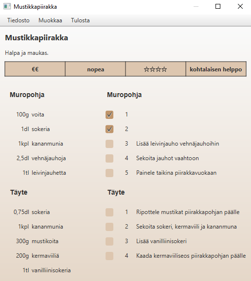
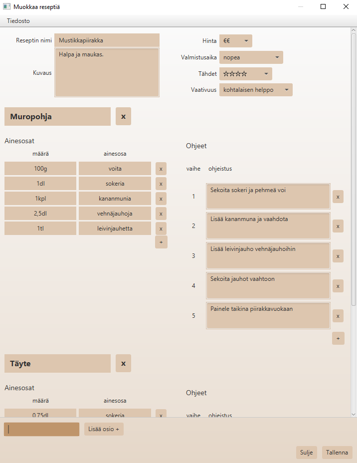
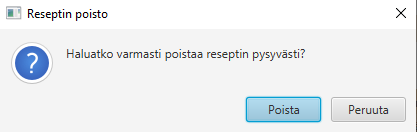
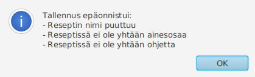
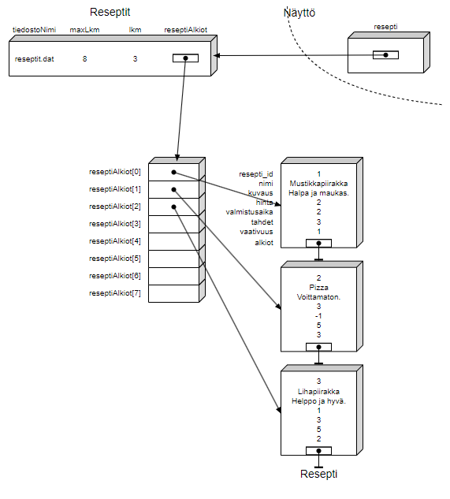
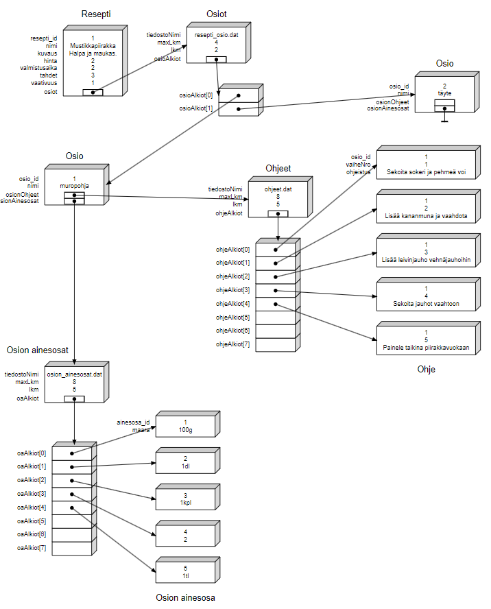

# Reseptien hallinta

Sovellus ruoanlaittoreseptien hallitsemiseen.

## Ohjelman käynnistys

Ohjelma voidaan käynnistää komentoriviltä antamalla komento:

```bash
java -jar reseptihaku.jar
```

### Edellytykset käynnistämiselle

Ohjelma vaatii [Javan](https://www.java.com/) olevan asennettuna laitteelle.

## Reseptihaku

Reseptejä pystyy

- selaamaan
- suodattamaan
- järjestämään
- katselemaan
- lisäämään
- muokkaamaan
- poistamaan


## Reseptinäkymä

<a name="nakyma"></a>

Reseptinäkymässä reseptin tiedot ovat katseltavissa ja valmistusvaiheita voi merkitä suoritetuksi. Reseptin saa avattua myös muokkausnäkymään tai poistaa.



## Muokkausnäkymä

<a name="muokkaus"></a>

Muokkausnäkymässä reseptin tiedot ovat muutettavissa ja osioita, ainesosia sekä ohjeita voidaan lisätä ja poistaa. Reseptin saa myös poistettua.



## Toiminnot

### Hakeminen

Käyttäjä voi kirjoittaa hakusanan hakukenttään ja klikata _Hae_, jolloin ohjelma suorittaa hakutoiminnon valituilla suodatusasetuksilla.
Ohjelma näyttää tulokset kaikista resepteistä, joissa hakusana ilmenee missä hyvänsä kohtaa niiden nimeä.

Jos hakukenttään ei syötä mitään, ohjelma hakee kaikista resepteistä valituilla suodatusasetuksilla. Mahdollistaa reseptien selaamisen pelkkien suodattimien avulla.

Hakua vastanneet reseptit lajitellaan valitun sarakkeen perusteella (oletus: reseptin nimi). Hakusana näytetään kohdassa 'tulokset hakusanalle "{hakusana}"'.

Jos haku ei täsmännyt mitään, ei tehdä kuitenkaan ilmoitusta.

### Hakutulosten suodattaminen

Vasemmalla olevassa palkissa olevia suodattimia säätämällä voidaan rajata saatuja hakutuloksia mieluisiksi. Lisäksi hakutulokset saa lajiteltua reseptin nimen, hintaluokan, valmistusajan, tähtien tai vaativuustason perusteella. Järjestyksen saa myös käännettyä.

Suodattimien jättäminen tyhjäksi ei muuta hakutuloksia. (oletuksena suodattimet pois päältä)

Suodattimen muuttaminen vaikuttaa välittömästi hakutuloksiin.

### Reseptin avaaminen

Reseptin saa avattua tuplaklikkaamalla haluttua reseptiä hakutuloksista tai painamalla "Avaa" reseptin ollessa valittuna.

[Reseptinäkymä](#nakyma) avautuu uuteen ikkunaan.

### Reseptin lisääminen

Uuden reseptin saa luotua valitsemalla _Muokkaa_-valikosta _Lisää uusi resepti_.

Ohjelma avaa uuden reseptipohjan [muokkausnäkymän](#muokkaus).

### Reseptin muokkaaminen

Reseptejä saa muutettua reseptihakusivulta valitsemalla _Muokkaa_ reseptin ollessa valittuna. [Muokkausnäkymä](#muokkaus) avautuu uuteen ikkunaan.

### Reseptin poistaminen

Reseptejä saa poistettua valitsemalla _Poista_, reseptin ollessa valittuna.

Ohjelma varmistaa poistamisaikeen käyttäjältä.



### Satunnainen resepti

Klikkaamalla _Avaa satunnainen resepti_ -painiketta ohjelma arpoo ja avaa **suodatetuista hakutuloksista** satunnaisen reseptin.

Jos ei ole hakutuloksia, ei nosta kuitenkaan ilmoitusta.

### Tallenna

Ohjelma varmistaa että reseptillä on nimi ja että siihen on lisätty vähintään yksi osio, joka sisältää vähintään yhden ainesosan tai yhden ohjeen.

Jokaisella osiolla reseptissä tulee olla eri nimi, eikä mikään ainesosa saa ilmestyä **samassa osiossa** useampaan kertaan.

Jos jokin vaatimus ei täyty, ohjelma ilmoittaa puutteista eikä tallenna.



Jos kaikki OK, ohjelma tallentaa reseptin tiedostoon (ei tee ilmoitusta).

### Valmistusvaiheiden ruksiminen

[Reseptinäkymässä](#nakyma) käyttäjä voi halutessaan merkitä ohjeiden eri vaiheita suoritetuksi klikkaamalla vaiheen vieressä olevaa laatikkoa. Vaiheen saa takaisin näkyviin klikkaamalla laatikkoa uudestaan.

Laatikon ollessa aktiivisena (ruksittu), kyseisen vaiheen teksti piilotetaan helpottamaan vaiheiden seuraamista.

Valinnat eivät ole pysyviä, vaan palautuvat oletusasetukseen (ei ruksittu) kun käyttäjä sulkee sivun.

## Tietorakennekuvat





## Tallennusmuoto

Ohjelman tiedot tallennetaan seuraavanlaisiin tekstitiedostoihin:

**reseptit.dat**

```bash
;resepti_id |nimi             |kuvaus           |hinta |valmistusaika |tähdet |vaativuus
1           |Mustikkapiirakka |Halpa ja maukas. |2     |2             |3      |1
2           |Pizza            |Voittamaton.     |3     |              |5      |3
3           |Lihapiirakka     |Helppo ja hyvä.  |1     |3             |5      |2
```

Jossa

- hinta on arvo väliltä [1, 3] (€, €€, €€€)
- valmistusaika on arvo väliltä [1, 5] (välitön, extra pitkä)
- tähdet on arvo väliltä [1, 5] (☆ - ☆☆☆☆☆)
- vaativuus on arvo väliltä [1, 5] (helppo, työläs)

**resepti_osio.dat**

```bash
;resepti_id |osio_id |nimi
1           |1       |muropohja
1           |2       |täyte
2           |3       |pohja
2           |4       |tomaattikastike
2           |5       |täytteet
```

**osion_ainesosat.dat**

```bash
;osio_id |ainesosa          |määrä
1        |voita             |100g
1        |sokeria           |1dl
1        |kananmunia        |1kpl
1        |vehnäjauhoja      |2,5dl
1        |leivinjauhetta    |1tl
2        |sokeria           |0,75dl
2        |kananmunia        |1kpl
2        |mustikoita        |300g
2        |kermaviiliä       |200g
2        |vanilliinisokeria |1tl
```

**ohjeet.dat**

```bash
;osio_id |vaihe |ohje
1        |1     |Sekoita sokeri ja pehmeä voi
1        |2     |Lisää kananmuna ja vaahdota
1        |3     |Lisää leivinjauho vehnäjauhoihin
1        |4     |Sekoita jauhot vaahtoon
1        |5     |Painele taikina piirakkavuokaan
2        |1     |Ripottele mustikat piirakka pohjan päälle
2        |2     |Sekoita sokeri, kermaviili ja kananmuna
2        |3     |Lisää vanilliinisokeri
2        |4     |Kaada kermaviiliseos piirakkapohjan päälle
```

## Testit

Ohjelman osille on kirjoitettu runsaasti testejä helpottamaan kehitystä. Testien generoimiseen käytetty pääosin ComTest-pluginia, testit toimivat myös osana dokumentointia.

## Lisätiedot

Ohjelmointi 2 -kurssin harjoitustyö.

Tekijä: Karri Hakomäki

Tarkempi kuvaus harjoitustyöstä: [TIMissä](https://tim.jyu.fi/view/kurssit/tie/ohj2/2023s/ht/hakokakr).
